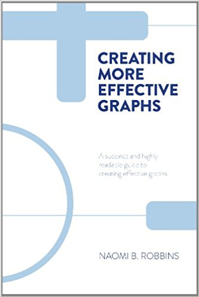

## Getting Started

```{r setup, include=FALSE}
knitr::opts_chunk$set(echo = T)
library(clifro)
library(dplyr)
library(tidyr)
library(ggplot2)
library(purrr)
library(grid)
library(reshape2)
library(gridExtra)
library(praise)
library(RColorBrewer)
```


## Resources 

Exercises taken from:

https://github.com/jennybc/r-graph-catalog

which are based on:



## Exercise 1 - Rank the categories


```{r, echo=FALSE}
this_base <- "fig01-01_similar-pie-wedges"

my_data <- data.frame(
  variable = c("A", "B", "C", "D", "E"), 
  value = c(23, 22, 19.5, 18.5, 17))

p <- ggplot(my_data, aes(x = factor(1), y = value))                        +
  geom_bar(width = 1, colour = "black", fill = "white", stat = "identity") + 
  geom_text(aes(x = 1.7, y = cumsum(value) - 10, label = variable))        +
  coord_polar(theta = "y")                                                 + 
  ggtitle("Similar Pie Wedges")                                            +
  theme_bw()                                                               +
  theme(panel.grid.major = element_blank(),
        panel.border = element_blank(),
        plot.title = element_text(size = rel(1.5), face = "bold"),
        axis.title = element_blank(),
        axis.text = element_blank(),
        axis.ticks = element_blank())

p

ggsave(paste0(this_base, ".png"), p, width = 6, height = 5)

```

## How did you do? 

```{r, echo=FALSE}
p + geom_text(aes(x = 1.2, y = cumsum(value)-10, label = value), size=14)
  
  
```


## Exercise 2 - Distance - common base

```{r, echo=FALSE}
this_base <- "fig01-02_similar-pie-wedges-dot-plot"

my_data <- data.frame(
  variable = c("A", "B", "C", "D", "E"),
  value = c(23, 22, 18.5, 19.5, 17))

p <- ggplot(my_data, aes(x = value, y = reorder(variable, value))) +  
  geom_point()                                                     +
  scale_x_continuous(limits = c(0, 25))                            +
  ggtitle("Dot Plot")                                              + 
  theme_bw()                                                       +
  theme(panel.grid.major.x = element_blank(),
        panel.grid.major.y = element_line(colour = "grey50"),
        plot.title = element_text(size = rel(1.2), face = "bold", vjust = 1.5),
        axis.title = element_blank(),
        axis.text.x = element_blank(),
        axis.ticks.x = element_blank()) 

p

ggsave(paste0(this_base, ".png"), 
       p, width = 7, height = 4)
 
```

## How did you do? 

```{r, echo=FALSE}
p + geom_text(aes(x = value, label = value), size = 14, nudge_y = 0.3) 
  
```

## Exercise 3 - Area and Volume


```{r, echo=FALSE}
library(ggplot2)

this_base <- "fig03-02_area-and-volume-judgments" 

my_data <- data.frame(
  val1 = c(0.75, 2, 3, 4, 5, 5, 6, 7, 8),
  val2 = c(4, 6, 6, 8, 6, 5, 1, 0.5, 9),
  area = c(5, 8, 0.25, 4, 9, 0.5, 6, 1, 12))

p <- ggplot(my_data, aes(x = val1, y = val2, size = area)) +
  geom_point(shape = 21, show.legend = FALSE)              + #@ map z to area and make larger circles
  scale_size_area(max_size = 25)                           +
  scale_x_continuous(breaks = seq(2, 8, 2),
                     limit = c(0, 9), 
                     expand = c(0, 0))                     +
  scale_y_continuous(breaks = seq(0, 10, 2),
                     limit = c(0, 10),
                     expand = c(0, 0))                     +
  ggtitle("Area and Volume judgements")                    +
  theme_bw()                                               +
  theme(panel.grid.major = element_blank(),
        plot.title = element_text(size = rel(1.5), face = "bold", vjust = 1.5),
        axis.title = element_blank())

p

ggsave(paste0(this_base, ".png"), 
       p, width = 6, height = 5)

## note: my_data is estimated

```

## How did you do? 


```{r, echo = FALSE}

p +  geom_text(aes(label=area),size=6, check_overlap=T) 
  

```

## Exercise 4 - Length

```{r, echo=FALSE}

this_base <- "fig03-04_length-judgments" 

my_data <- data.frame(ylow = c(4.2, 1.5, 2.5, 5, 2.4), 
                      yhigh = c(6.0, 3.8, 4.9, 7.6, 5.4))
my_data$lab <- my_data$yhigh - my_data$ylow

p <- ggplot(my_data, aes(x = c(0, 6), y = range(c(ylow, yhigh)), label = lab)) + 
  geom_segment(aes(x = 1:5, y = ylow, xend = 1:5, yend = yhigh))               +
  scale_x_continuous(breaks = seq(0, 6, 1), limit = c(0, 6))                   +
  scale_y_continuous(limit = c(0,8))                                           +
  ggtitle("Length judgements")                                                 +
  theme_bw()                                                                   +
  theme(panel.grid.major = element_blank(),
        plot.title = element_text(size = rel(1.2), face = "bold", vjust = 1.5),
        axis.title = element_blank()) 

p

ggsave(paste0(this_base, ".png"), 
       p, width = 6, height = 4)


```

## How did you do? 

```{r, echo = FALSE}

 p <- ggplot(my_data, aes(x = c(0, 6), y = range(c(ylow, yhigh)), label = lab)) + 
  geom_segment(aes(x = 1:5, y = ylow - ylow, xend = 1:5, yend = yhigh - ylow))  +
  scale_x_continuous(breaks = seq(0, 6, 1), limit = c(0, 6))                    +
  scale_y_continuous(limit = c(0,8))                                            +
  ggtitle("Length judgements")                                                  +
  theme_bw()                                                                    +
  theme(panel.grid.major = element_blank(),
        plot.title = element_text(size = rel(1.2), face = "bold", vjust = 1.5),
        axis.title = element_blank()) 

p
```

## That's why stacked bar charts are **never** recommended 

```{r, echo = FALSE, fig.align="center"}
this_base <- "fig02-11_energy-data"

my_data <- data.frame(
  year = factor(77:86),
  us = c(1320, 1280, 1350, 1400, 1470, 1420, 1440, 1580, 1520, 1610),
  japan = c(405, 405, 480, 500, 490, 495, 480, 480, 500, 530),
  germany = c(220, 225, 290, 320, 300, 280, 260, 240, 220, 225),
  other = c(1280, 1195, 1310, 1390, 1270, 1200, 1100, 1100, 1040, 1080))

my_data_long <- melt(my_data, id.vars = "year",
                  measure.vars = c("us", "japan", "germany", "other"), 
                  variable.name = "country", value.name = "value")

p <- ggplot(my_data_long, aes(x = year, y = value, fill = country, width = 0.6)) + 
  geom_bar(stat = "identity")                                                    + # hack to hide slashes in legend
  geom_bar(stat = "identity", colour = "black", width = 0.7, show.legend=FALSE)  +
  scale_y_continuous(breaks = seq(0, 3500, 500),
                     labels = c(0, "", 1000, "", 2000, "", 3000, ""),
                     limits = c(0, 4000), expand = c(0, 0))                      +
  scale_fill_manual("variable" ,
                    values = c('grey40', '#FFFFFF','#000000','grey60'),
                    labels = c("US", "Japan", "West Germany", 
                               "All Other OECD"))                                +
  labs(x = NULL, y = "Millions of Gallons")                                      +
  ggtitle("Energy Data")                                                         +
  theme_bw()                                                                     +
  theme(panel.grid.major = element_blank(),
        plot.title = element_text(size = rel(1.2), face = "bold", vjust = 1.5),
        axis.title = element_text(face = "bold"),
        axis.text = element_text(),
        legend.position = "bottom",
        legend.direction = "vertical",
        legend.key.width = unit(2, "lines"),
        legend.key.height = unit(0.5, "lines"),
        legend.title = element_blank()) 

p

ggsave(paste0(this_base, ".png"), 
       p, width = 6, height = 5)
```


## Finally colour, hue, saturation, density

```{r, echo = FALSE, fig.height=5, fig.width=7, fig.align="centre"}

this_base <- "fig03-03_color-hue-saturation-and-density"

set.seed(100)

my_data <- data.frame(x = rnorm(100, mean = 20, sd = 10),
                      y = c(rnorm(50, mean = 20, sd = 10), 
                            rnorm(50, mean = 25, sd = 10)),
                      country = rep(c("England", "France", "Italy"), c(33, 33, 34)))

p1 <- ggplot(my_data, aes(x = x, y = y, group = country))         +
  geom_point(aes(shape = country), show.legend = FALSE)           +
  scale_x_continuous(breaks = seq(0, 40, 10), limits = c(-5, 47)) +
  scale_y_continuous(breaks = seq(0, 40, 10), limits = c(-5, 47)) + 
  theme_bw()                                                      +
  theme(panel.grid.major = element_blank(),
        panel.grid.minor = element_blank())   


p2 <- p1 + 
  geom_point(aes(shape = country, colour = country), show.legend = FALSE)           +
  scale_colour_manual(values = c("grey10", "black", "grey50")) 


p3 <- arrangeGrob(p1, p2, ncol = 2)

grid.draw(p3)

ggsave(paste0(this_base, ".png"), p3, width = 4, height = 6)

## note: my_data is simulated replace original

```

## Finally colour, hue, saturation, density (cont...)

```{r, echo = FALSE, fig.height=5, fig.width=7, fig.align="centre"}


p4 <- p1 + 
  geom_point(aes(shape = country, colour = country), show.legend = FALSE)+
  scale_color_brewer(type="div")

p <- arrangeGrob(p2, p4, ncol = 2)
grid.draw(p)
```

## Finally colour, hue, saturation, density (cont...)

```{r, echo = FALSE, fig.height=5, fig.width=7, fig.align="centre"}


p5 <- p1 + 
  geom_point(aes(shape = country, colour = country), show.legend = FALSE)+
  scale_color_brewer(type="seq")

p <- arrangeGrob(p2, p5, ncol = 2)
grid.draw(p)
```
 
## Finally colour, hue, saturation, density (cont...)

```{r, echo = FALSE, fig.height=5, fig.width=7, fig.align="centre"}


p6 <- p1 + 
  geom_point(aes(shape = country, colour = country), show.legend = FALSE)+
  scale_color_brewer(type="qual")

p <- arrangeGrob(p2, p6, ncol = 2)
grid.draw(p)
```
## End of principles session...

```{r}
praise()
```


## Can we apply Cleveland's and Robbin's principles to multidimentional data? {.build .smaller}

 Make the data stand out. Avoid superfluity

 Use visually prominent graphical elements to show the data

 Do not clutter the data region

 Do not overdo the number of tick marks

 Use a reference line when there is an important value that must be seen across the entire graph, but do not let that line interfere with the data

 Overlapping plotting symbols must be visually distinguishable

 Superimposed datasets must be readily visually discriminated

 Visual clarity must be preserved under reduction and reproduction


## Accessing the NIWA climate database

```{r, eval=TRUE}
public_user <- cf_user() # Defaults to "public"

#select using menus
#out <- cf_datatype() 
```

## or programatically

```{r, eval=TRUE}
wind_dt  <-  cf_datatype(2, 1, 4, 1)

# Daily Rain
rain_dt  <-  cf_datatype(3, 1, 1)

# Daily temperature extremes
temp_dt  <-  cf_datatype(4, 2, 1)
all_dts  <-  wind_dt + rain_dt + temp_dt
all_dts

reefton_st = cf_station()
reefton_st
```


## Reefton Data

```{r}

reefton_data <-  cf_query(public_user, all_dts, reefton_st,
paste(as.Date(Sys.time()) - 333, "9"))

str(reefton_data)
```

## From list to a dataframe

```{r}
reefton_data_df <- reefton_data %>% 
  map_df(`[`)
head(reefton_data_df)
```

## From wide to long for plotting

```{r}
reefton_data_long <- reefton_data_df %>% 
  select(Station,Date.local,Amount.mm, Tmin.C,Speed.ms) %>% 
  gather(measure,data,-Station,-Date.local) %>% 
  filter(!is.na(data))

reefton_data_long$Year <- format(reefton_data_long$Date.local, "%Y")

```


## Let's plot 

```{r, fig.align="center"}
(p_initial <- ggplot(reefton_data_long,aes(Date.local,data))+
  geom_point(aes(colour=measure)))
```

## Let's apply Cleveland's principles...

What things are superflous?
```{r, echo=F}
p_initial
```

## Let's apply Cleveland's principles...

Do the graphical elements clearly show the data?
```{r, echo=F}
p_initial
```

## Let's apply Cleveland's principles...

Are the number of tick marks ok?
```{r,, echo=F}
p_initial
```

## Let's apply Cleveland's principles...

Are overlapping plotting symbols visually distinguisable?
```{r,, echo=F}
p_initial
```

## Let's apply Cleveland's principles...

Are superimposed datasets visually distinguisable?
```{r, echo=F}
p_initial
```

## How should we fix this graph? 

## Separate superimposed dataset {.smaller}
```{r, fig.width=5, fig.height=4}
ggplot(reefton_data_long,aes(Date.local,data))+
  geom_point(aes(colour=measure))             +
  facet_grid(measure~.)                         #separate datasets
```


## Common y scale not needed {.smaller}
```{r,fig.width=5, fig.height=4}
ggplot(reefton_data_long,aes(Date.local,data))+
  geom_point(aes(colour=measure))             +
  facet_grid(measure~., scales = "free_y")          #variable y-scale
```


## Make overlapping data easier to distinguish {.smaller}
```{r,fig.width=5, fig.height=4}
ggplot(reefton_data_long,aes(Date.local,data))+
  geom_point(aes(colour=measure),shape=1)     +   #show data overlap
  facet_grid(measure~., scales = "free")         
  
```


## Remove superfluous legend {.smaller}
```{r,fig.width=5, fig.height=4}
ggplot(reefton_data_long,aes(Date.local,data))+
  geom_point(aes(colour=measure),shape=1)     +   
  facet_grid(measure~., scales = "free_y")      + 
  theme(legend.position="none")                   #legend not needed
```


## Move labels to outside the y axis {.smaller}
```{r,fig.width=5, fig.height=4}
ggplot(reefton_data_long,aes(Date.local,data))              +
  geom_point(aes(colour=measure),shape=1)                   +   
  facet_grid(measure~., scales = "free_y", switch="y")      +   #label on left size
  theme(legend.position="none",strip.placement = "outside")                                 #label outside of y axis
```

## Label x and y axis meaningfully {.smaller}
```{r,fig.width=5, fig.height=4}
ggplot(reefton_data_long,aes(Date.local,data))              +
  geom_point(aes(colour=measure),shape=1)                   +   
  facet_grid(measure~., scales = "free_y", switch="y")      +   
  theme(legend.position="none",strip.placement = "outside") +                   
  ylab("")                                                  + #label superfluous
  xlab("Date")                                                #make label more meaningful
```


## Remove extra shading {.smaller} 
```{r,fig.width=5, fig.height=4}
ggplot(reefton_data_long,aes(Date.local,data))              +
  geom_point(aes(colour=measure),shape=1)                   +  
  facet_grid(measure~., scales = "free_y", switch="y")      +  
  theme(legend.position="none",strip.placement = "outside") +  
  ylab("")                                                  + 
  xlab("Date")                                              +                                              
  theme_bw()                                                 #overrides previous theme
```


## Remove extra shading {.smaller}
```{r,fig.width=5, fig.height=4}
ggplot(reefton_data_long,aes(Date.local,data))              +
  geom_point(aes(colour=measure),shape=1)                   + 
  facet_grid(measure~., scales = "free_y", switch="y")      + 
  ylab("")                                                  + 
  xlab("Date")                                              + 
  theme_bw()                                                + 
   theme(legend.position="none",strip.placement = "outside")                                 #legend not needed; move strip to outside of y axis
 
```

## Change format of dates {.smaller}
```{r}
p1 <- (
  ggplot(reefton_data_long,aes(as.Date(Date.local),data))   + #explicit date class
  geom_point(aes(colour=measure),shape=1)                   +
  facet_grid(measure~., scales = "free_y", switch="y")      +
  ylab("")                                                  +
  xlab("Date")                                              +
  theme_bw()                                                +
   theme(legend.position="none",strip.placement = "outside")+                   
 scale_x_date(date_labels = "%m-%Y")                         #format of date 
 )
```

## Change format of dates {.smaller}
```{r, echo = F}
p1
```

##  Change format of dates {.smaller}
```{r}
p1 <- (
ggplot(reefton_data_long,aes(as.Date(Date.local),data))     + 
  geom_point(aes(colour=measure),shape=1)                   + 
  facet_grid(measure~., scales = "free_y", switch="y")      + 
  ylab("")                                                  + 
  theme_bw()                                                + 
   theme(legend.position="none",strip.placement = "outside")+                   
 scale_x_date(date_labels = "%B %Y")                       #format of date
)
```

##  Change format of dates {.smaller}
```{r, echo = F}
p1
```

## Changing the labels {.smaller}
```{r}
reefton_data_long$measure <- factor(reefton_data_long$measure, 
  labels = c("Rainfall~amount~(mm)",
             "Wind~speed~(ms^-1)", 
             "Min~daily~temp~(degree*C)"
              ))

p1 <- (
ggplot(reefton_data_long,aes(as.Date(Date.local),data))     + 
  geom_point(aes(colour=measure),shape=1)                   + 
  facet_grid(measure~., scales = "free_y", switch="y", 
             labeller = label_parsed)                       + # parses math expressions
  ylab("")                                                  +
  xlab("Date")                                              +
  theme_bw()                                                +
  theme(legend.position="none",strip.placement = "outside") +                   
 scale_x_date(date_labels = "%B %Y")                        
)
  

```

## Changing the labels {.smaller}
```{r, echo = F}
p1
```


## Finally remove the box around the labels {.smaller}
```{r}
p_final <- (
ggplot(reefton_data_long,aes(as.Date(Date.local),data))     + 
  geom_point(aes(colour=measure),shape=1)                   + 
  facet_grid(measure~., scales = "free_y", switch="y", 
             labeller = label_parsed)                       + 
  ylab("")                                                  +
  xlab("Date")                                              +
  theme_bw()                                                +
   theme(legend.position="none",strip.placement = "outside",  
         strip.background = element_blank())                + #no background                  
 scale_x_date(date_labels = "%B %Y")
)
```

## Finally remove the box around the labels {.smaller}
```{r, echo=F}
p_final
```

## Compare back to the initial default graph
```{r, echo = F}
plots <- arrangeGrob(p_initial, p_final, ncol = 2)
grid.draw(plots)
```


