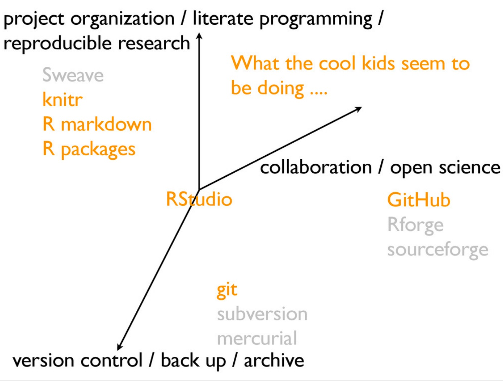

```{r setup, include=FALSE}
knitr::opts_chunk$set(echo = FALSE)
```

## Prerequisites {.smaller}

[R project](https://www.r-project.org), local mirror http://cran.stat.auckland.ac.nz.

R uses a `major.minor.patchlevel` numbering scheme, with a yearly minor release, and up to 4 patches within a year. Keep your version up to date.

[RStudio](https://www.rstudio.com/products/rstudio/download2/)

RStudio uses continuous integration, use the latest stable release for compatibility with contributed packages such as [htmlwidgets](https://cran.r-project.org/web/packages/htmlwidgets/index.html), [knitr](https://cran.r-project.org/web/packages/knitr/index.html), and [markdown](https://cran.r-project.org/web/packages/rmarkdown/index.html).

## Use GitHub projects {.smaller}



<font size=3>--[_https://speakerdeck.com/jennybc/ubc-stat545-2015-cm001-intro-to-course_](https://speakerdeck.com/jennybc/ubc-stat545-2015-cm001-intro-to-course)</font>

## Proxy configuration {.smaller}

Set proxy configuration variables, e.g. inside Plant and Food Research;

```
## Set proxy environment variables
Sys.setenv(
  "http_proxy"  = "http://proxy.pfr.co.nz:8080",
  "https_proxy" = "http://proxy.pfr.co.nz:8080",
  "ftp_proxy"   = "http://proxy.pfr.co.nz:8080",
  "no_proxy"    = "localhost,*.pfr.co.nz"
)

```

## Installing from CRAN {.smaller}

Select a CRAN mirror

```{r eval=FALSE, echo=TRUE}
library(dplyr)
## Fetch all mirrors
getCRANmirrors()%>% ## Filter AUS, NZ mirrors
  filter(Country%in%c("Australia", "New Zealand"))

options(repos=c(CRAN="https://stat.auckland.ac.nz/"))
## rstudio mirror
options(repos=c(CRAN="https://cran.rstudio.com/"))
```


Use `install.packages()` to install CRAN packages
```R
install.packages("[PACKAGE_NAME]")

## See help
help("install.packages")
```

## Installing Bioconductor packages {.smaller}

The sourced script

```R
## Download BiocInstaller R package
source("https://www.bioconductor.org/biocLite.R")

## Install a package
BiocInstaller::biocLite("[PACKAGE_NAME]")
```

Installs the [BiocInstaller](https://bioconductor.org/packages/release/bioc/html/BiocInstaller.html)  package which can install Bioconductor, CRAN, and some github packages.

```{r eval=FALSE}
packageDescription("BiocInstaller")
```

What mirrors?

```{r eval=FALSE, echo=TRUE}
library(BiocInstaller)
biocinstallRepos(siteRepos=character(), version=biocVersion())
```

## Installing Github packages {.smaller}

The [devtools](https://cran.r-project.org/web/packages/devtools/index.html) package provides the utility `install_github()` which can install Github R packages from any fork, any branch.

You must set your Github personal access token to access private repositories

* https://help.github.com/articles/creating-a-personal-access-token-for-the-command-line/


```R
## Set your GITHUB_PAT
#Sys.setenv("GITHUB_PAT"="...297255545518a...")

## Bootstrap install the latest Github version
devtools::install_github("devtools")
```

## [CRAN](https://cran.r-project.org/web/packages/available_packages_by_name.html) versus [Github](https://github.com/) version? {.smaller}

You need to determine from the DESCRIPTION file which is the latest stable release or most actively developed version and decide which to install e.g. devtools

* Look at the version numbering in the Github [DESCRIPTION](https://github.com/hadley/devtools) file versus [CRAN](https://cran.r-project.org/web/packages/devtools/index.html)
* [Network diagram](https://github.com/hadley/devtools/network) to examine active development


## See also {.smaller}

* http://r4ds.had.co.nz/introduction.html#prerequisites
* http://adv-r.had.co.nz
* http://swirlstats.com
* http://happygitwithr.com/ssh-keys.html