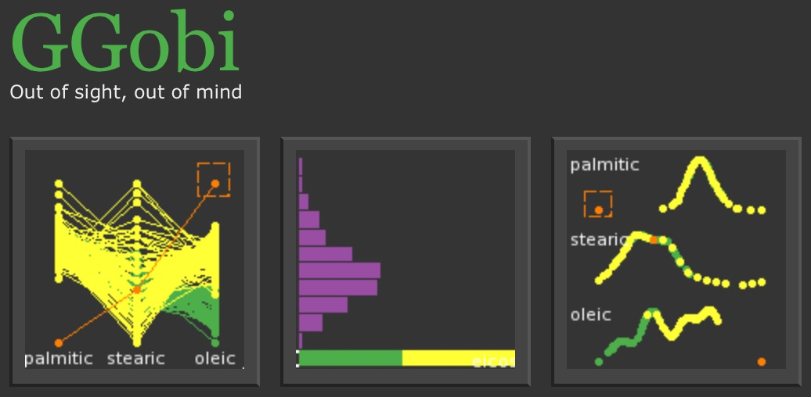
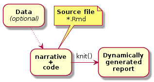
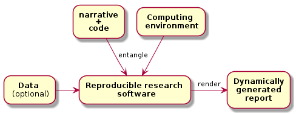
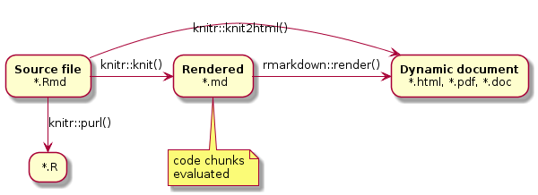
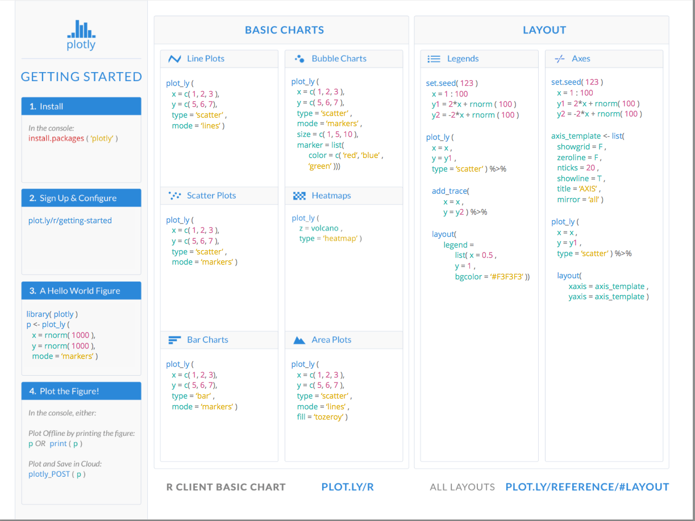
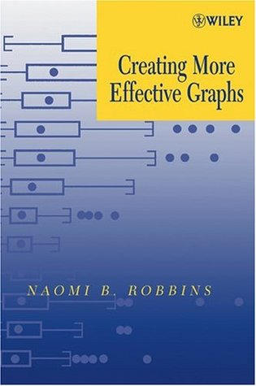
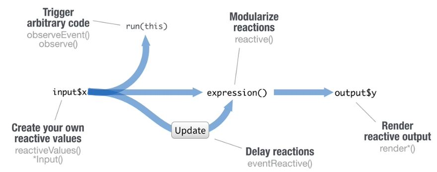

```{r setup, include=FALSE}
knitr::opts_chunk$set(echo = FALSE)

library(leaflet)
library(magrittr)
library(ggplot2)
library(ggthemes)
library(plotly)
library(dplyr)
library(rbokeh)

## read gbs_data
dset <- read.table("data/gbs_dataset.txt", header=TRUE)
```


## Why use Dynamic Visualization? {.smaller}

* Enhances exploration of multivariate datasets
* Add annotation information to graphics
* Great for collaboration
* Effective teaching resource
* Source code reproducibility

Educational examples;

[_http://rpsychologist.com/d3/tdist_](http://rpsychologist.com/d3/tdist)   
[_http://rpsychologist.com/d3/NHST_](http://rpsychologist.com/d3/NHST)

## Early dynamic graphics in R {.smaller}

Dynamic visualization in R started with standalone applications such as

<table align="right">
<tr>
<td>

</td>
</tr>
<tr>
<td>

</td>
</tr>
</table>

* http://lib.stat.cmu.edu/general/XGobi
* http://www.ggobi.org

R packages [xgobi](https://cran.r-project.org/web/packages/xgobi/index.html) and [rggobi](https://cran.r-project.org/web/packages/rggobi/index.html) provide interfaces to these projects


## Recent emerging frameworks {.smaller}

[leaflet](http://leafletjs.com)

open-source JavaScript library for mobile-friendly interactive maps, designed with simplicity, performance and usability in mind

[plotly.js](https://plot.ly/javascript)

Built on top of [d3.js](https://d3js.org) and [stack.gl](http://stack.gl/), plotly.js is a high-level, declarative charting library. plotly.js ships with 20 chart types, including 3D charts, statistical graphs, and SVG maps

[bokeh](http://bokeh.pydata.org/en/latest)

Python interactive visualization library that targets modern web browsers for presentation. Its goal is to provide elegant, concise construction of novel graphics in the style of [d3.js](https://d3js.org)

[Vega](https://vega.github.io/vega)

A visualization grammar, a declarative language for creating, saving, and sharing interactive visualization designs


## Shift to using HTML5 + CSS + javascript {.smaller}

Built on the R package [knitr](https://cran.r-project.org/web/packages/knitr/index.html) + [rmarkdown](http://rmarkdown.rstudio.com)

> _[knitr](https://cran.r-project.org/web/packages/knitr/index.html) is an engine for dynamic report generation with R._
> _It is a package in the statistical programming language R that enables integration of R code into LaTeX, LyX, HTML, Markdown, AsciiDoc,_
> _and reStructuredText documents. &nbsp;&nbsp;&nbsp;&nbsp;&nbsp;&nbsp; --[Wikipedia](https://en.wikipedia.org/wiki/Knitr)_

[rmarkdown](http://rmarkdown.rstudio.com) is an R flavoured extension to the [markdown](https://daringfireball.net/projects/markdown/) text-to-HTML conversion language

<div align="center"></div>


## Rationalle   {.smaller}

* [HTML5](https://www.w3.org/TR/html5/) + [CSS](https://www.w3.org/standards/techs/css) + [javascript](https://en.wikipedia.org/wiki/ECMAScript)
* Dynamic report generation
* Reproducible research paradigm

<table>
</tr>
<td></td>
<td> &nbsp;&nbsp;&nbsp;&nbsp;&nbsp;</td>
<td></td>
</tr>
</table>


## New dynamic graphics R packages {.smaller}

* [leaflet](https://cran.r-project.org/web/packages/leaflet/index.html) - Create and customize interactive maps using the 'Leaflet' JavaScript library and the 'htmlwidgets' package

* [plotly](https://cran.r-project.org/web/packages/plotly/index.html) - Easily translate 'ggplot2' graphs to an interactive web-based version and/or create custom web-based visualizations directly from R.

* [rbokeh](https://cran.r-project.org/web/packages/rbokeh/index.html) - A native R plotting library that provides a flexible declarative interface for creating interactive web-based graphics, backed by the Bokeh visualization library

* [shiny](https://cran.r-project.org/web/packages/shiny/index.html) - Build interactive web applications with R.

_All available on [CRAN](https://cran.r-project.org/) and [GitHub](http://www.github.com)_

_Graphics rendered in RStudio Viewer, Rmarkdown documents, and as web browser content_


## Interactive maps using leaflet {.smaller}

```{r echo=TRUE}
leaflet(width=600, height=350)    %>%
  addTiles() %>%  # Add default OpenStreetMap map tiles
  addMarkers(lng=172.4758827, lat=-43.6402388, popup="Workshop venue")
```


## plotly R package {.smaller}

Package available from;

* https://github.com/ropensci/plotly
* https://cran.r-project.org/web/packages/plotly/index.html

Integrates with `base` and `ggplot2` graphics

<table align="right">
<tr>
<td>

</td>
<td>

</td>
</tr>
</table>

* [Getting started](https://plot.ly/r/getting-started)
* [Cheatsheet](https://images.plot.ly/plotly-documentation/images/r_cheat_sheet.pdf)
* [Online book](https://cpsievert.github.io/plotly_book)

_Examples at_ [_https://plot.ly/r_](https://plot.ly/r)


## plotly() for `base` graphics {.smaller}

```r
plot_ly(economics, x = ~date, y = ~unemploy / pop,
        type="scatter", mode="markers")
```
```{r warning=FALSE}
plot_ly(economics, x = ~date, y = ~unemploy / pop, type="scatter", mode="markers", height=400, width=600)
```


## ggplotly() wrapper for `ggplot2` graphics  {.smaller}

```R
ggplotly(ggplot(data=dset, aes(x=Count, y=cutSite, colour=method)) +
  geom_point()                                                     +
  geom_smooth(method="lm")                                         +
  labs(x="Read counts", y="# Restriction sites"))
```
```{r warning=FALSE, fig.height=3.5}
ggplotly(ggplot(data=dset, aes(x=Count, y=cutSite, colour=method)) +
  geom_point()                                                     +
  geom_smooth(method="lm")                                         +
  labs(x="Read counts", y="# Restriction sites") + theme_bw())
```


## rbokeh {.smaller}

Package available from;

* https://github.com/bokeh/rbokeh
* https://cran.r-project.org/web/packages/rbokeh/index.html

Documentation at

* http://hafen.github.io/rbokeh

Examples

* https://bl.ocks.org/timelyportfolio/8300c43ac43d772600df

<!-- pipe image... -->
Same approach as ggplot, uses the [magrittr](https://cran.r-project.org/web/packages/magrittr/index.html) package pipe operator "%>%" to build graphic layers.


## rbokeh example #1 {.smaller}

```R
source("examples/01_rbokeh.R")
```

```{r echo=FALSE}
# prepare data
elements <- subset(elements, !is.na(group))
elements$group <- as.character(elements$group)
elements$period <- as.character(elements$period)

# add colors for groups
metals <- c("alkali metal", "alkaline earth metal", "halogen",
  "metal", "metalloid", "noble gas", "nonmetal", "transition metal")
colors <- c("#a6cee3", "#1f78b4", "#fdbf6f", "#b2df8a", "#33a02c",
  "#bbbb88", "#baa2a6", "#e08e79")
elements$color <- colors[match(elements$metal, metals)]
elements$type <- elements$metal

# make coordinates for labels
elements$symx <- paste(elements$group, ":0.1", sep = "")
elements$numbery <- paste(elements$period, ":0.8", sep = "")
elements$massy <- paste(elements$period, ":0.15", sep = "")
elements$namey <- paste(elements$period, ":0.3", sep = "")

# create figure
p <- figure(title = "Periodic Table", tools = c("resize", "hover"),
  ylim = as.character(c(7:1)), xlim = as.character(1:18),
  xgrid = FALSE, ygrid = FALSE, xlab = "", ylab = "",
  height = 333, width = 600, xaxes=FALSE, yaxes=FALSE) %>%

# plot rectangles
ly_crect(group, period, data = elements, 0.9, 0.9,
  fill_color = color, line_color = color, fill_alpha = 0.6,
  hover = list(name, atomic.number, type, atomic.mass,
    electronic.configuration)) %>%

# add symbol text
ly_text(symx, period, text = symbol, data = elements,
  font_style = "bold", font_size = "10pt",
  align = "left", baseline = "middle") %>%

# add atomic number text
ly_text(symx, numbery, text = atomic.number, data = elements,
  font_size = "6pt", align = "left", baseline = "middle") %>%

# add name text
ly_text(symx, namey, text = name, data = elements,
  font_size = "4pt", align = "left", baseline = "middle") %>%

# add atomic mass text
ly_text(symx, massy, text = atomic.mass, data = elements,
  font_size = "4pt", align = "left", baseline = "middle")

p
```

--[_http://hafen.github.io/rbokeh/index.html#preview_](http://hafen.github.io/rbokeh/index.html#preview)


## rbokeh example #2 {.smaller}

_Using broom package to collate model fits_

```R
source("example/02_rbokeh.R")
```

```{r echo=FALSE}
library(rbokeh)
library(broom)

## Collate models
models <- dset     %>% 
  group_by(method) %>% 
  do(fit=lm(cutSite ~ Count, data=.))

## Augment
models_aug <- models %>% 
  augment(fit)

figure(height = 360, width = 600)                    %>%
  ly_points(Count, cutSite, data=dset, color=method,
            hover=list(Count, cutSite, method))      %>%  ## Add points
  ly_lines(Count, .fitted, data=models_aug, group=method) ## Add models
```

## Shiny Package {.smaller}

A web application framework for R

Websockets communicate between a client (web browser) and a server to update computation as the client interface changes
<!-- websocketd discussion ... -->

R package available from;

* https://cran.r-project.org/web/packages/shiny/index.html
* https://github.com/rstudio/shiny

Also `shinydashboard`, provides dashboard themes for shiny

* https://cran.r-project.org/web/packages/shinydashboard/index.html
* https://github.com/rstudio/shinydashboard

-[_https://rstudio.github.io/shinydashboard_](https://rstudio.github.io/shinydashboard)
<!-- dashboard picie -->

## Deployment on a Shiny server {.smaller}

Download [RStudio Shiny Server v1.5.3.838](https://www.rstudio.com/products/shiny/download-server)
available for Ubuntu / Redhat / SuSE

_Windows, Mac OS X not currently supported as server platforms_

Open source vs pro version https://www.rstudio.com/products/shiny/shiny-server

Can deploy Shiny apps on cloud services at http://www.shinyapps.io   
&rarr; _See [User guide](http://docs.rstudio.com/shinyapps.io/index.html)_

Deployment options

* GitHub change control https://github.com
* Packrat dependency management https://rstudio.github.io/packrat
* rstudio connect https://www.rstudio.com/products/connect


## Shiny scalability {.smaller} 

<!-- worker concept -->
Potential scalability issues

_Certainly with the open source shiny server_

The Shiny [pro version](https://www.rstudio.com/products/shiny/shiny-server) scales applications across multiple processes

### Streaming data

* Maintain large amounts of data server side
* Use data.table::fread() for large datasets   
&rarr; _order of magnitude faster than read.table()_


## Shiny example {.smaller}

All graphs in [Creating More Effective Graphs, Naomi B. Robbins](https://www.amazon.com/Creating-Effective-Graphs-Naomi-Robbins/dp/0985911123)

Illustration at https://github.com/jennybc/r-graph-catalog

<table>
<tr>
<td>
```bash
## ssh
git clone git@github.com:jennybc/r-graph-catalog.git
## https
git clone https://github.com/jennybc/r-graph-catalog

## change directory
cd r-graph-catalog
```

```R
## In R, run app
runApp("r-graph-catalog")
```
</td>
<td>

</td>
</tr>
</table>


## Shiny file structure {.smaller}

Shiny files

* ui.R        - _defines user interface_
* server.R    - _defines server functions, what to do when user interface changes_
* global.R    - _defines globals available to ui.R, server.R (optional)_
* DESCRIPTION - _key value pairs in showcase mode (optional)_
* README.md   - _Documentation!_
* www         - _directory for images, css, js (optional)_


_Version 0.10.2, Shiny supports single-file applications_

$\mbox{ui.R} + \mbox{server.R} = \mbox{app.R}$

<!-- image from cheatsheet? -->
## Shiny application example {.smaller}

In app.R file
```r
library(shiny)
ui <- fluidPage(                       ## Define the interface
  numericInput(inputId = "bins" ,
               "Number of bins", value = 25),
  plotOutput(outputId = "hist")
)
server <- function(input, output) {    ## How server reacts to interface changes
  output$hist <- renderPlot({
  set.seed(42)
  validate(need(input$bins>1, "1 or more bins required"))
    hist(rnorm(1000), breaks=seq(-6, 6, length=input$bins+1))
    })
}

shinyApp(ui = ui, server = server)     ## Create a shiny app object
```

Execution
```R
shiny::runApp("examples/01_shiny", display.mode="showcase")
```

## Shiny developer resources {.smaller}

<table>
<tr>
<td>
* [Shiny tutorial](https://shiny.rstudio.com/tutorial)
* [Shiny articles](https://shiny.rstudio.com/articles)
* [Gallery](https://shiny.rstudio.com/gallery)
</td>
<td>
&nbsp;&nbsp;&nbsp;&nbsp;&nbsp;&nbsp;&nbsp;&nbsp;
</td>
<td align="center">
<!-- iframe embedding is not resizing... -->
2hr25m video <br />
 <object width="400" height="300">
  <param name="movie" value="http://www.youtube.com/v/G1-HDDDK87M" />
  <param name="wmode" value="transparent" />
  <embed src="http://www.youtube.com/v/G1-HDDDK87M"
         type="application/x-shockwave-flash"
         wmode="transparent" width="400" height="300" />
</object>
</td>
</table>


## Shiny uses reactive programming {.smaller}

Reactivity

`sources` = inputs, `conductors` = intermediate components, `endpoints` = outputs

<table>
<tr>
<td>

</td>
<td>
&nbsp;&nbsp;&nbsp;&nbsp;&nbsp;&nbsp;&nbsp;&nbsp;&nbsp;&nbsp;
&nbsp;&nbsp;&nbsp;&nbsp;&nbsp;&nbsp;&nbsp;&nbsp;&nbsp;&nbsp;
&nbsp;&nbsp;&nbsp;&nbsp;&nbsp;&nbsp;&nbsp;&nbsp;&nbsp;&nbsp;
</td>
<td>

</td>
</tr>
</table>

Simplest example: When `input$obs` changes, `output$distPlot` is notified that it needs to re-execute


```R
server <- function(input, output) {    ## How server reacts to interface changes
  output$hist <- renderPlot({
  validate(need(input$bins>1, "1 or more bins required"))
    hist(rnorm(1000), breaks=seq(-5, 5, length=input$bins+1))
    })
}
```

[_https://shiny.rstudio.com/articles/reactivity-overview.html_](https://shiny.rstudio.com/articles/reactivity-overview.html)


## Reactive elements {.smaller}

<table>
<tr>
<td>
<p>Reactive conductors can reuse (cache) computation<br />required by multiple reactive endpoints</p>
</td>
<td>
&nbsp;&nbsp;&nbsp;&nbsp;
</td>
<td>

</td>
</tr>
</table>

Reactive flow diagram http://shiny.rstudio.com/tutorial



```R
shiny::runApp("examples/02_shiny", display.mode="showcase")
```

## Github shiny examples {.smaller}

Over 100 simple examples at https://github.com/rstudio/shiny-examples

```bash
## ssh
git clone git@github.com:rstudio/shiny-examples.git
## https
git clone https://github.com/rstudio/shiny-examples.git
```

In R
```R
## shiny-examples working directory
setwd("[PATH_TO]/shiny-examples")

## Run an example
shiny::runApp('003-reactivity')
```

This is a good demonstration repository to test and modify shiny examples


## Debugging shiny apps {.smaller}

* Know your computing environment use `sessionInfo()`
* Avoid installing local `.libPath()` libraries
* Use shiny server logs for server deployment
* Shiny server not required to develop applications

Development client side is faster

* Write to STDOUT using `cat()`, `print()`
* Add a browser() or break points using RStudio
* Print user interface `ui.R` HTML to STDOUT
* Print HTML form variables

-- _[https://shiny.rstudio.com/articles/debugging.html](https://shiny.rstudio.com/articles/debugging.html)_

```R
options(shiny.reactlog=TRUE)
shiny::showReactLog()
```
<!--
Split the shiny  reactLog section?
-->

## Shiny template + testing suite {.smaller}

* [_RWorkshops/DataVisualization/Part_2/examples/template1_](https://github.com/PlantandFoodResearch/DataScienceWorkshop/Day_2/DataVisualization/Part_2/examples/template1)
* [_RWorkshops/DataVisualization/Part_2/examples/template2_](https://github.com/PlantandFoodResearch/DataScienceWorkshop/DataScienceWorkshop/Day_2/DataVisualization/Part_2/examples/template2)

* Abstract functions for testing into `global.R`
   - Use `testthat` package to unit test observed versus expected results


```R
## In R, run app
runApp('examples/template1')
runApp('examples/template2')
```

To run the test suite

```bash
cd examples/template1/tests

Rscript testthat.R
Test global.R functions: ..

DONE ===========================================================================
```

## Shiny + (leaflet `or` plotly `or` rbokeh) {.smaller}

Enhance R graphics in shiny applications with interactive graphics

All of these frameworks integrate into shiny applications

```R
## Shiny Output functions
leaflet::leafletOutput
plotly::plotlyOutput
rbokeh::rbokehOutput
```

```R
## In R, run app
runApp('examples/03_shiny')
```
Documentation

* [_https://rstudio.github.io/leaflet/shiny.html_](https://rstudio.github.io/leaflet/shiny.html)
* [_https://plot.ly/r/shiny-tutorial_](https://plot.ly/r/shiny-tutorial)
* [_https://rdrr.io/cran/rbokeh/man/rbokehOutput.html_](https://rdrr.io/cran/rbokeh/man/rbokehOutput.html)


## Customizing Dynamic Graphics {.smaller}

Rasterizing large amounts of data, `Datashader` graphics pipeline system

https://github.com/bokeh/datashader

Datashader decouples data processing from visualization    
&rarr; can rasterize millions of datapoints into images.

<table>
<tr>
<td>

</td>
<td>
&nbsp;&nbsp;
</td>
<td>

</td>
</tr>
</table>

&nbsp;   
If interactive graphics need to be tailored specific questions, and you want fine control probably have to use [d3.js](https://d3js.org)

* [d3 gallery](https://github.com/d3/d3/wiki/Gallery)


## Session information {.smaller}

```{r sessionInfo}
sessionInfo()
```

