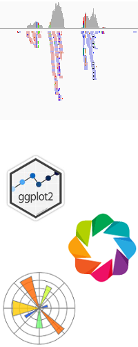
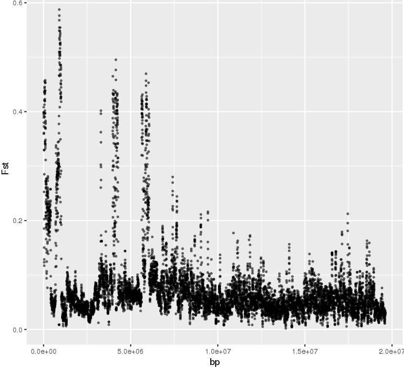
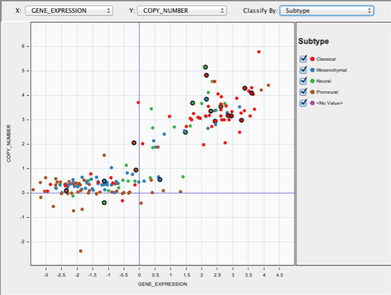
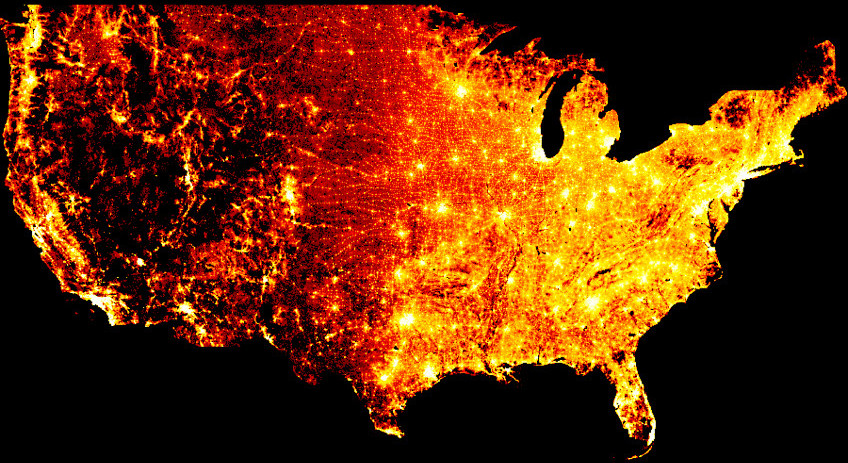
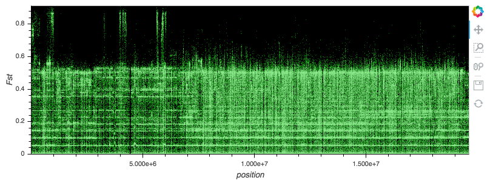
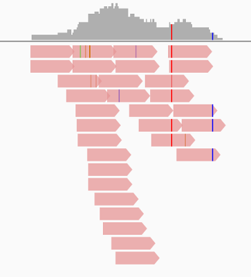
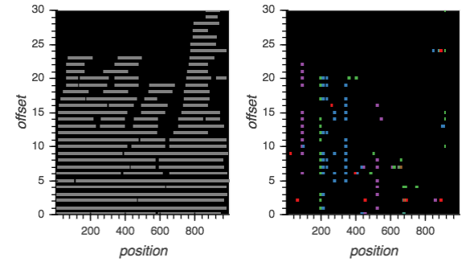
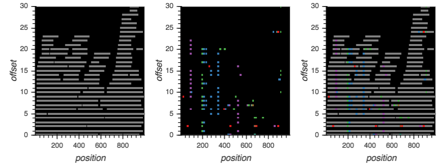
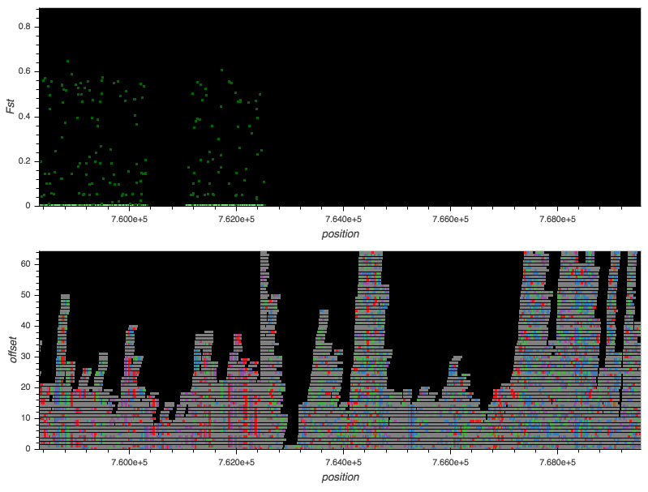
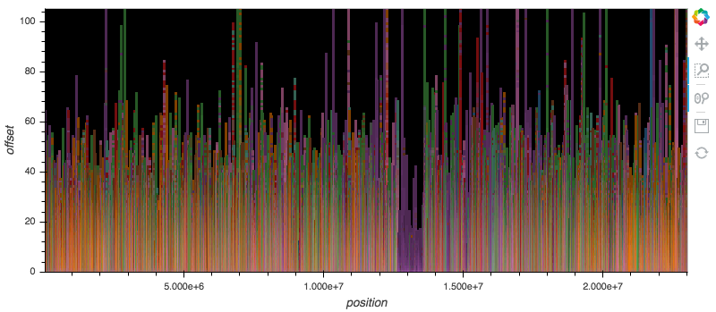

## Issues Visualising Genome Scale Data

<div class="columns-2">

- Genome browsers for viewing specific file formats
	  - not flexible 


- Plotting libraries for viewing statistical results
	  - struggle with genome scale data


	  


</div>

## Aims

- Flexible, ad hoc plotting 
- Genome scale data (millions of points)
- Statistical data
- Bioinformatic data

## Example: Site-wise F<sub>ST</sub>

- Measure of population differentiation due to genetic structure
- In this case differentiation between male and female Kiwifruit
- Indicates proportion of variance explained by population structure
- Calculated in ANGSD
- Sex Chromosome: 16,995,348 points

## Windowed F<sub>ST</sub> in ggplot



## Scatter Plots in IGV?



## Datashader




## Sitewise F<sub>ST</sub> in Datashader




## Datashader with Bokeh

- Heatmap-like raster images with pixels as cells
    1. Projection
    2. Aggregation
    3. Transformation
- Can be wrapped with Bokeh to provide interactivity 


## Datashader + Bokeh is complex

```{python, eval = FALSE}
def interactive_xy(df, xcol='', ycol='', **kwargs):
    # LOTS MORE CODE TO HANDLE OPTIONS
    # create the base plot
    plot = figure(**kwargs)
    # function for image replotting
    def create_image(x_range, y_range, w, h):
        cvs = ds.Canvas(**kwargs)
        agg = cvs.points(df, xcol, ycol)
        img = tf.shade(agg, cmap=palette, how=shade_method)
        return tf.dynspread(img, threshold=density_threshold, max_px=max_px)
    # plot the interactive image
    export_image(create_image(x_range, y_range, width, height), 'export')
    return InteractiveImage(plot, create_image)
```

## Why HoloViews? | A high level wrapper for Bokeh, Datashader and more

## Why HoloViews? | A high level wrapper for Bokeh, Datashader and more

```{python eval = FALSE}
plot = datashade(hv.Points(data, kdims=['position', 'Fst']))
```


## Genomic Data?


## Genomic Data? | Example: aligned reads

- Aligned reads from one male (female reference)
- 4,311,450 reads (paths)
- 6,995,750 variants (points)
- Stacking?
- Compose read and variants layers?


## Stacking Reads 




## Stacking Reads

```{python}
def stack(reads):
    cache = {}
    for start, stop in reads:
        height = 0
        searching = True
        while searching:
            if height in cache:
                if start < cache[height]:
                    height += 1
                else:
                    cache[height] = stop
                    searching = False
            else:
                cache[height] = stop
                searching = False
        yield height
```

## Composing Layers

```{python eval = FALSE}
reads = dynspread(datashade(holoviews.Path(read_data)))
variants = dynspread(datashade(holoviews.Points(var_data)))
reads + variants
```

## Composing Layers

```{python eval = FALSE}
reads = dynspread(datashade(holoviews.Path(read_data)))
variants = dynspread(datashade(holoviews.Points(var_data)))
reads + variants
```



## Composing Layers

```{python eval = FALSE}
reads = dynspread(datashade(holoviews.Path(read_data)))
variants = dynspread(datashade(holoviews.Points(var_data)))
reads + variants + (reads * variants)
```




## F<sub>ST</sub> with Aligned Reads




## Transposon distribution in Grape | Grape Genetic Improvement Programme




## Concluding Remarks

- Datashader for visualising massive data sets
    - datashader.org
- Bokeh for interactive figures
    - bokeh.pydata.org
- HoloViews for making life easy
    - holoviews.org

## Acknowledgements


**Kiwifruit Breeding Programme**: Data & Funding


**Grape Genetic Improvement Programme**: Data


