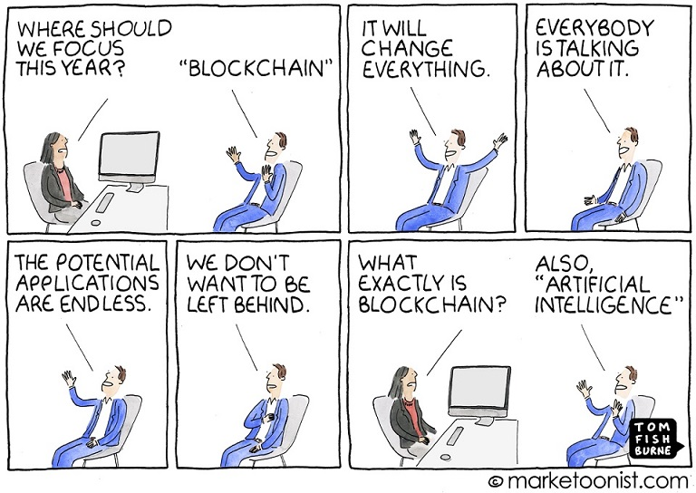
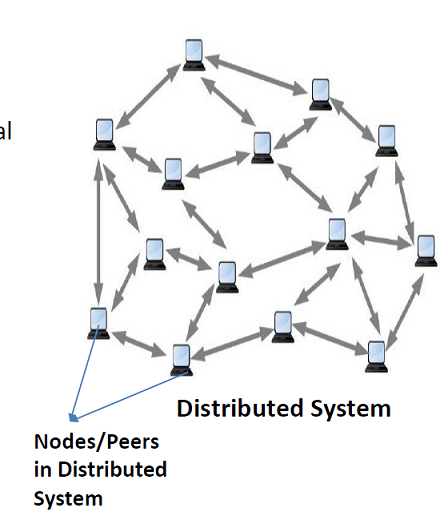
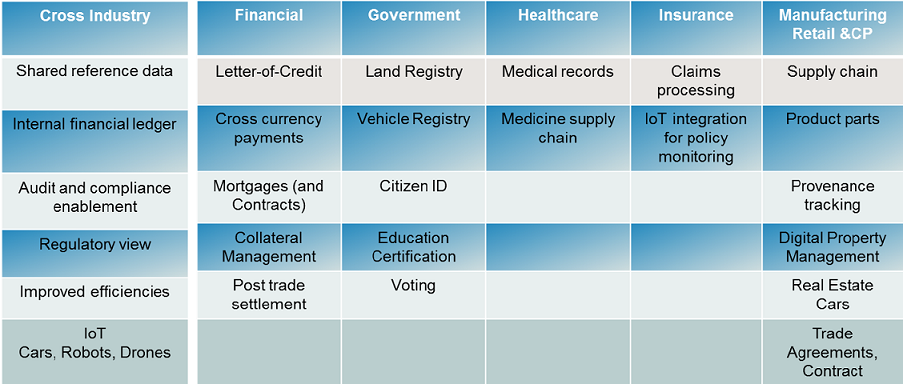

# Blockchain | The very little that I've learnt { .slide.. }

## Blockchain | The technology behind cryptocurriencies

[Coinmarketcap](https://coinmarketcap.com/ "Coin Market Cap")

## 

## Attributes of blockchain {.titled..}

Consensus

- all parties in the business network agree on the kind of information to be captured about an asset

Provenance

- parties are able to trace records (of an asset) to its source

Immutability

- records in a ledger cannot be altered or removed

Finality

- when a transaction is committed there is no rolling back

## The basic idea {.titled..}

## The basic idea {.titled..}

Shared ledger

- Append-only distributed system of record shared across business network

Privacy

- Transactions are secure, authenticated & verifiable

Smart contract

- Business terms embedded in transaction database & executed with transactions

Trust

- Transactions are endorsed by relevant participants

## Use cases {.titled..}

## Private vs Public blockchain

Permissionless blockchain 

- anyone can join the network. E.g., bitcoin, ethereum, 

Permissioned blockchain, or private blockchain

- requires pre-verification of the participating parties within the network

- these parties are usually known to each other.

## Hyperledger Fabric

An implementation of blockchain technology that is intended as a foundation for developing blockchain applications

Key technical features:

- A shared ledger and smart contracts implemented as "chaincode"
- Privacy and permissioning through membership services
- Modular architecture and flexible hosting options

## Hyperledger fabric

[Hyperledger fabric](https://hyperledger-fabric.readthedocs.io/en/latest/build_network.html "Hyperledger fabric")

## Hyperledger composer

[Hyperledger Composer](https://composer-playground.mybluemix.net/editor "Hyperledger composer")

## Oraclize.it

[Oraclize it](http://www.oraclize.it/ "Oraclise.it")

