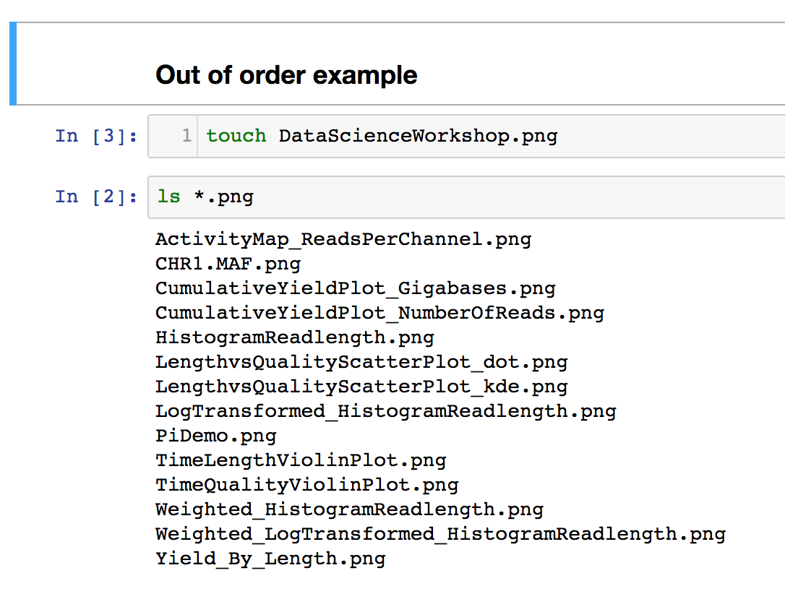
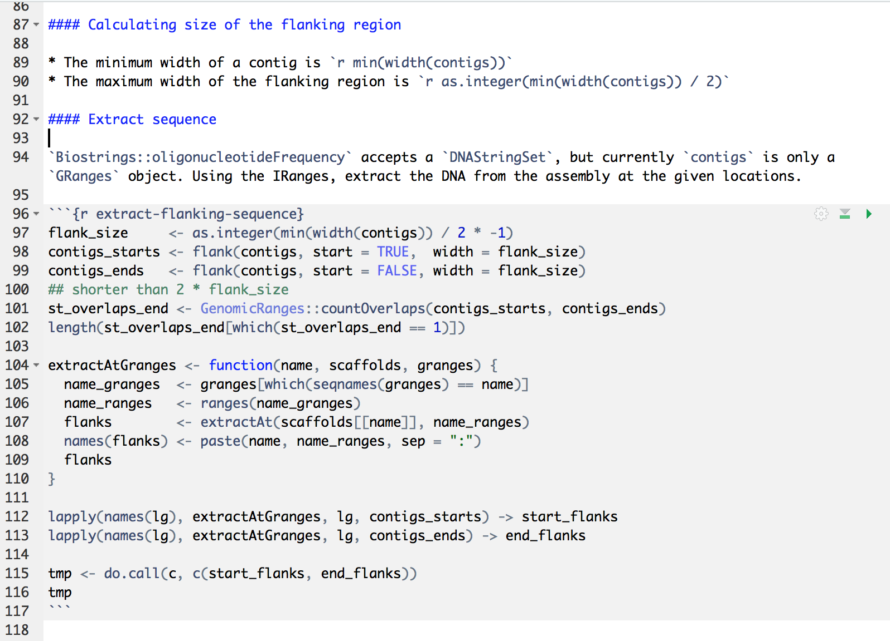
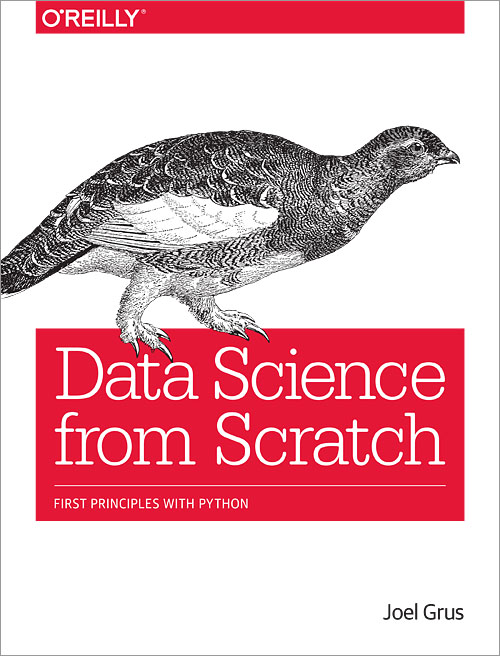

```{r setup, include = FALSE}
knitr::opts_chunk$set(echo = TRUE,
                      eval = FALSE,
                      warning = FALSE)
pkg_name <- 'TestUtils'
```

# Practising {.slide}

## Things I'm going to mention {.titled..}

* Testing
* Continuous Integration
* Static Code Analysis
* Notebooks (R and Jupyter)

# Are you talking to me? {data-background=img/travis.jpg}

## Why should I listen? {.titled.. .larger}

> "data science should follow the rules of good software engineering!"
- [@Grus2018]

## The game is Hypothesis testing {.titled..}

* **Reproducibility** [@Peng2011] - test condition is met
* 10 Simple Rules [@Sandve2013]
* Results of data collection/analysis used to **test hypothesis**
    - using several different methodologies [@Drummond2017]
* While I'm not talking about **p-hacking** [@Simmons2011 and @Nuzzo2014]
* **Excel** deserves a dishourable mention as the cause of *gene name errors are widespread in the scientific literature* [@Ziemann2016]

<!--

But, Drummond points out, scientists are generally not interested in experimental results for their own sake; rather, we use experimental results to test hypotheses. The best way to test a hypothesis is to carry out several different experiments, using different methodologies, to provide convergent evidence. Drummond says that what scientists are really interested in is the *retestability* of a given hypothesis - not the reproducibility of a given piece of data. - [@Drummond2017]

-->

## Collaboration, Usage

In the case of open source software which is now basis of data and analytical science [@Ince2012]

* Other users need trust
* Check applicable to their systems and data needs
* Installation
* Contribution model
* Exemplar usage

## How - R development tools

* Git has transformed software development
    - scientific coding [@Perkel2018]
* Language tooling
* http://github.com/r-lib/

```{r r-lib}
library(devtools)
library(usethis)
library(testthat)
```


## Creating a new package

```{r new_package}
pkg_name <- 'TestUtils'
usethis::create_package(path = pkg_name,
                        open = FALSE,
                        fields = list(Description = "TestUtils package",
                                      Title       = "Provides an example of testing",
                                      Package     = pkg_name))
```


## Enabling testing

```{bash, eval = TRUE, include = FALSE}
rm -rf TestUtils/tests
```

```{r use_testthat, eval = TRUE}
setwd(pkg_name)
usethis::use_testthat()
```

```{bash, eval = TRUE, include = FALSE}
cp data/testthat/* TestUtils/tests/testthat/
```

## Anatomy of a testsuite

```{r testsuite, eval = TRUE, engine = 'bash', results='markup'}
tree --charset=ascii TestUtils/tests 
```

## Anatomy of a testfile

```{bash testfile, eval = TRUE}
cat TestUtils/tests/testthat/test-simple.R
```

## Simple

```{r simple_test}
context("Simple Test")
test_that("Simple Description", {
  ## simple test case
  expect_true(TRUE, label = "TRUE really is TRUE")
  ## data vs expectation
  data <- 1:100
  expect_equal(data, 1:100, label = "data matches sequence")
})
```

## Failing Tests

```{r failing_test, eval = FALSE}
context("Simple Test")
test_that("Simple Description", {
  ## simple test case that will fail
  expect_true(FALSE, label = "TRUE really is TRUE")
})
```

## Enabling Continuous Integration

```{r use_travis}
setwd(pkg_name)
usethis::use_travis()
```

# {data-background=img/travis-example.png}

## Enabling Coverage Metrics

- Do tests exercise all code?
- [`library(covr)`](https://github.com/r-lib/covr)

```{r covr, results = 'hide'}
setwd(pkg_name)
usethis::use_coverage(type = "coveralls")
```

# {data-background=img/coveralls.png}

## Library Example {data-background=img/appsecret.png}

## Notebooks

* Notebooks are fun / useful
* Notebooks have problems [@Grus2018]
    - order of execution
    - hidden state
    - how do you test / know code is correct
    - dependencies
    - not a text editor

## Jupyter vs RStudio {.titled..}

<div class="columns-2">

&nbsp;

</div>

# &nbsp; { .slide.. }



## R Notebooks and testing

```{r testing-in-notebook, eval = TRUE, include = TRUE}
internal_package <- "TestUtils"
devtools::load_all(path = internal_package)
devtools::test(pkg = internal_package)
```

## References {.smaller}